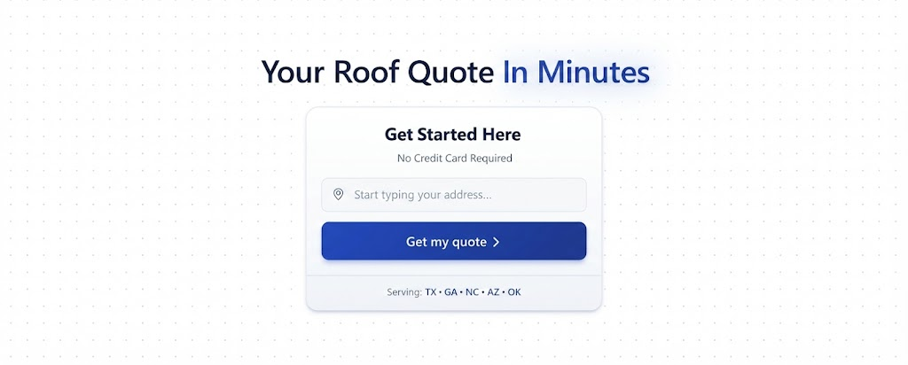

<p align="center">
  
</p>

# Results Roofing

[](https://github.com/galaxy-co-ai/results-roofing/actions/workflows/ci.yml)
[](https://www.typescriptlang.org/)
[](https://nextjs.org/)
[](#license)

> Instant roof replacement quote platform for self-pay homeowners in premium markets.

## Overview

Results Roofing is a modern, self-service quote platform that enables homeowners to get roof replacement quotes in minutes, compare packages, schedule installation, e-sign contracts, and pay deposits online—all without a single phone call.

**Service Areas:** Texas | Georgia | North Carolina | Arizona

### Key Features

- **Instant Quotes** - Real-time pricing from satellite measurements
- **Self-Service Flow** - Complete quote-to-booking without phone calls
- **Transparent Pricing** - Full breakdown of materials, labor, and warranties
- **Financing Pre-Qual** - 60-second pre-qualification with clear monthly payments
- **Customer Portal** - Track project status, view documents, manage appointments

## Tech Stack

| Category | Technology |
|----------|------------|
| **Framework** | Next.js 14 (App Router) |
| **Language** | TypeScript 5.7 |
| **Database** | Neon PostgreSQL |
| **ORM** | Drizzle |
| **Auth** | Clerk |
| **Payments** | Stripe |
| **UI** | Ark UI (headless) + CSS Modules |
| **State** | TanStack Query + React Hook Form |
| **Validation** | Zod |
| **Testing** | Vitest + Playwright |
| **Deployment** | Vercel |

### External Integrations

- **Roofr** - Satellite roof measurements
- **JobNimbus** - CRM sync
- **Documenso** - E-signatures
- **Cal.com** - Appointment scheduling
- **Wisetack** - Financing
- **SignalWire** - SMS notifications
- **Resend** - Email delivery

## Getting Started

### Prerequisites

- Node.js 20+
- npm or yarn
- PostgreSQL database (we recommend [Neon](https://neon.tech))

### Installation

```bash
# Clone the repository
git clone https://github.com/galaxy-co-ai/results-roofing.git
cd results-roofing

# Install dependencies
npm install

# Copy environment variables
cp .env.example .env.local

# Set up your database
npm run db:push
npm run db:seed

# Start development server
npm run dev
```

Open [http://localhost:3000](http://localhost:3000) to view the application.

### Environment Variables

Copy `.env.example` to `.env.local` and configure the required variables. See the [Environment Setup Guide](docs/reference/troubleshooting.md) for detailed configuration instructions.

**Required for development:**
- `DATABASE_URL` - Neon PostgreSQL connection string
- `NEXT_PUBLIC_CLERK_PUBLISHABLE_KEY` - Clerk auth public key
- `CLERK_SECRET_KEY` - Clerk auth secret key

## Project Structure

```
results-roofing/
├── .github/              # GitHub workflows & templates
├── docs/                 # Project documentation
│   ├── planning/         # Planning documents (01-23)
│   ├── reference/        # Conventions, glossary, tech decisions
│   └── roadmap/          # Sprint planning & progress tracking
├── drizzle/              # Database migrations
├── public/               # Static assets
├── scripts/              # Utility scripts
├── src/
│   ├── app/              # Next.js App Router
│   │   ├── api/          # API routes
│   │   ├── quote/        # Quote flow pages
│   │   └── portal/       # Customer portal (protected)
│   ├── components/       # React components
│   │   ├── ui/           # Shared UI primitives
│   │   ├── layout/       # Layout wrappers
│   │   └── features/     # Feature-specific components
│   ├── db/               # Database schema & queries
│   ├── hooks/            # Custom React hooks
│   ├── lib/              # Utilities & services
│   │   ├── integrations/ # External service adapters
│   │   └── utils/        # Helper functions
│   ├── styles/           # Global styles & design tokens
│   └── types/            # TypeScript definitions
└── tests/                # Test setup & fixtures
```

## Available Scripts

| Script | Description |
|--------|-------------|
| `npm run dev` | Start development server |
| `npm run build` | Build for production |
| `npm run start` | Start production server |
| `npm run lint` | Run ESLint |
| `npm run lint:fix` | Fix ESLint errors |
| `npm run typecheck` | Run TypeScript check |
| `npm run test` | Run unit tests |
| `npm run test:coverage` | Run tests with coverage |
| `npm run test:e2e` | Run Playwright E2E tests |
| `npm run db:generate` | Generate Drizzle migrations |
| `npm run db:migrate` | Run migrations |
| `npm run db:push` | Push schema to database |
| `npm run db:studio` | Open Drizzle Studio |
| `npm run db:seed` | Seed pricing tiers |

## Documentation

### Planning Documents

| Document | Description |
|----------|-------------|
| [01-vision-and-goals](docs/planning/01-vision-and-goals.md) | Project vision, success criteria, differentiators |
| [02-user-personas](docs/planning/02-user-personas.md) | Target user profiles and needs |
| [03-product-requirements](docs/planning/03-product-requirements.md) | Functional requirements |
| [04-feature-breakdown](docs/planning/04-feature-breakdown.md) | Detailed feature specifications |
| [07-technical-architecture](docs/planning/07-technical-architecture.md) | System architecture |
| [08-data-models](docs/planning/08-data-models.md) | Database schema design |
| [15-file-architecture](docs/planning/15-file-architecture.md) | Code organization |
| [17-code-patterns](docs/planning/17-code-patterns.md) | Implementation patterns |

### Reference

| Document | Description |
|----------|-------------|
| [conventions](docs/reference/conventions.md) | Code style & conventions |
| [glossary](docs/reference/glossary.md) | Project terminology |
| [troubleshooting](docs/reference/troubleshooting.md) | Common issues & solutions |

## Development

### Code Style

This project uses ESLint and TypeScript for code quality. Run `npm run lint` and `npm run typecheck` before committing.

See [docs/reference/conventions.md](docs/reference/conventions.md) for detailed coding standards.

### Testing

```bash
# Run unit tests
npm run test

# Run tests in watch mode
npm run test -- --watch

# Run E2E tests
npm run test:e2e
```

### Database

```bash
# Generate migration after schema changes
npm run db:generate

# Apply migrations
npm run db:migrate

# Open Drizzle Studio to view data
npm run db:studio
```

## Contributing

We welcome contributions! Please see [CONTRIBUTING.md](CONTRIBUTING.md) for guidelines.

### Quick Start for Contributors

1. Fork the repository
2. Create a feature branch (`git checkout -b feature/amazing-feature`)
3. Make your changes
4. Run tests (`npm run test && npm run lint && npm run typecheck`)
5. Commit your changes (`git commit -m 'Add amazing feature'`)
6. Push to the branch (`git push origin feature/amazing-feature`)
7. Open a Pull Request

## Current Status

**Phase:** 3 - Implementation
**Progress:** ~40% toward MVP

### Completed
- Foundation planning documents
- Technical architecture design
- Database schema (12 tables)
- CI/CD pipeline
- Homepage UI
- Quote form skeleton

### In Progress
- Quote flow pages (measuring, packages, checkout)
- API endpoint development
- Integration adapters

### Upcoming
- Payment processing
- E-signature workflow
- Customer portal
- Webhook handlers

See [docs/roadmap/progress-tracker.md](docs/roadmap/progress-tracker.md) for detailed progress.

## License

Proprietary - Results Roofing / CB Media

This software is proprietary and confidential. Unauthorized copying, distribution, or use is strictly prohibited.

## Support

For questions or issues:
- Open a [GitHub Issue](https://github.com/galaxy-co-ai/results-roofing/issues)
- Review the [troubleshooting guide](docs/reference/troubleshooting.md)
